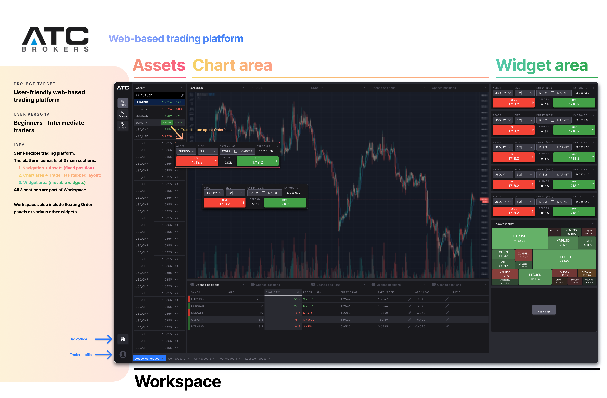

# atc-platform-frontend

Web Trading Platform for ATC Brokers (frontend)



# Description

NextJS app with NextAuth
NextJS lambda functions ([routes](./src/pages/api))
Prisma orm client
Webworker with websocket capabilities ([./src/dataworker.tsx](./src/dataworker.tsx))

## ENV file

Before anything, create local `.env` file from `.env.example`.

```
SPOTEX_URL="https://uat.spotex.com/secure/service/prime" - remove uat for production environment
JWT_SECRET - secret for session signing
API_URL - base api host + path (normally ends with /api)
API_SCHEMA= - https/http
DATABASE_URL= - full postgres connection url

SPOTEX_USERNAME= - for REST API provided by atc
SPOTEX_PASSWORD= - for REST API provided by atc

NEXT_PUBLIC_WEBSOCKET= - websocket for webworker, use base domain without path (will be added by socket.io library)

NODE_ENV="development" - development / production

NEWS_FEED="https://subscriptions.fxstreet.com/..." - provided by ATC
```

## NextJS bundle

Each NextJS page can use `useSession` in `Auth` wrapper (located in [\_app.tsx](./src/pages/_app.tsx)). Use this to guard agains unathorized access.
Similarly in api handlers/routes there is `getServerSession`.

## Prisma

There is [schema file](./prisma/schema.prisma) which contains pseudo database structure.
To generate/migrate, use `yarn prisma:migrate` / `yarn prisma:generate`, or `yarn prisma:format` for formatting.

# Start

`yarn dev`
& possibly `yarn prisma:generate`

# Build

`yarn build`
& possibly `yarn prisma:generate`

## Vercel

Commit to dev/main branch, their CI/CD will catch up. More [here](https://vercel.com/quantnote/atc-platform-frontend).
